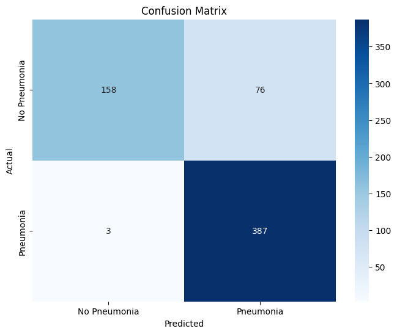
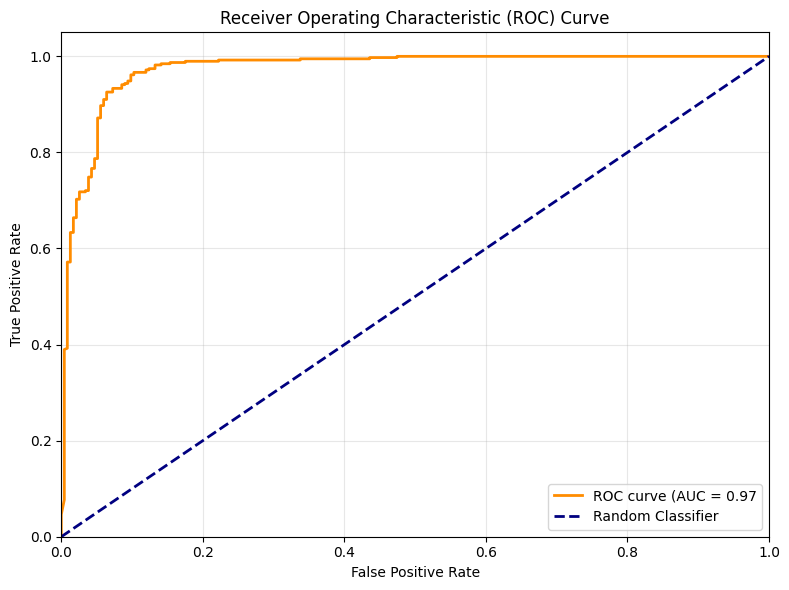
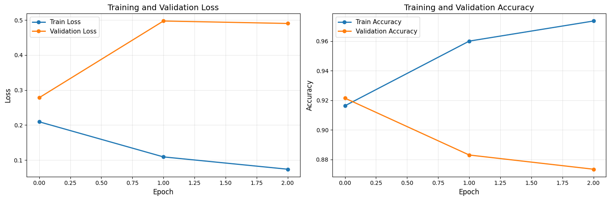
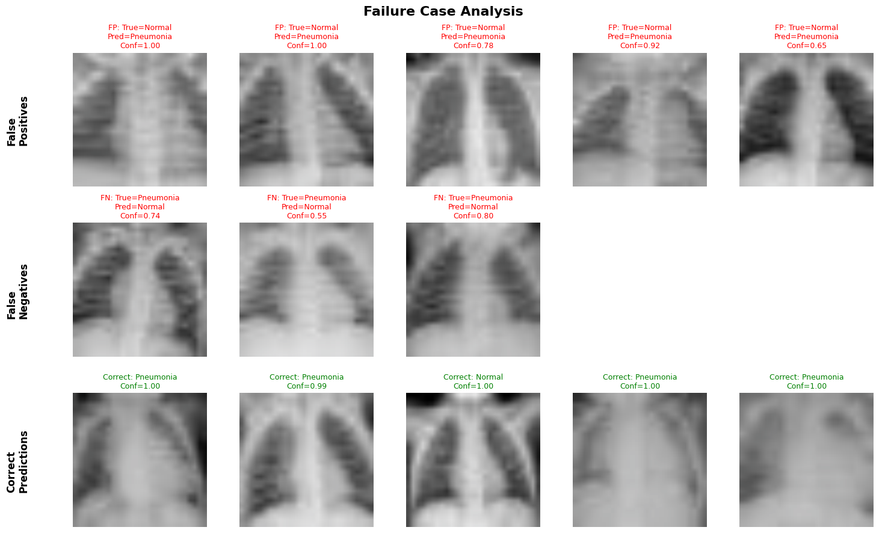

# Task 1: CNN Classification Report
## Pneumonia Detection from Chest X-rays using EfficientNet-B3

---

## 1. Model Architecture

### Selected Model
**EfficientNet-B3** with ImageNet pretrained weights

### Architecture Justification

I chose EfficientNet-B3 for this pneumonia classification task for several compelling reasons:

1. **Efficiency and Performance Balance**: EfficientNet-B3 uses compound scaling to balance network depth, width, and resolution, achieving state-of-the-art accuracy with approximately 12M parameters. This provides superior performance compared to B0 while remaining computationally feasible.

2. **Transfer Learning Advantage**: The model is pretrained on ImageNet, which provides robust low-level feature extraction (edges, textures, shapes) that transfers well to medical imaging despite the domain difference.

3. **Computational Feasibility**: Given the 7-day time constraint and Google Colab's free tier limitations (NVIDIA Tesla T4 with 15GB VRAM), EfficientNet-B3 offers an optimal trade-off between model capacity and training time. It can be trained efficiently on the PneumoniaMNIST dataset without requiring extensive computational resources.

4. **Scalability**: The EfficientNet family allows for easy scaling if more compute resources become available (B4, B5, B6, B7), making this a practical choice for iterative development.

5. **Medical Imaging Success**: EfficientNet architectures have demonstrated strong performance on various medical imaging tasks in recent literature, making it a proven choice for chest X-ray analysis.

### Architecture Details

```
Input Shape: 224 × 224 × 3 (RGB)
├── EfficientNet-B3 Backbone (pretrained on ImageNet)
│   ├── Stem: Conv3x3 + BatchNorm + Swish
│   ├── MBConv Blocks (7 stages with compound scaling)
│   │   └── Mobile Inverted Bottleneck Convolution
│   │       ├── Expansion layer (1x1 Conv)
│   │       ├── Depthwise Conv (3x3 or 5x5)
│   │       ├── Squeeze-and-Excitation block
│   │       └── Projection layer (1x1 Conv)
│   ├── Head: Conv1x1 + AdaptiveAvgPool2d
│   └── Feature dimension: 1536
│
└── Classification Head (Modified)
    ├── Dropout(p=0.3)
    └── Linear(1536 → 2)  [Binary Classification: Normal vs Pneumonia]

Total Parameters: ~12M
Trainable Parameters: ~12M (all layers trainable)
```

### Key Modifications
- **Final Layer**: Modified the classifier from 1000 classes (ImageNet) to 2 classes (binary classification)
- **Input Adaptation**: Converted grayscale chest X-rays to 3-channel RGB by repeating the grayscale channel to match pretrained weight expectations
- **Fine-tuning Strategy**: All layers unfrozen for full model fine-tuning on the medical imaging task
- **Dropout**: Increased dropout to 0.3 for better regularization

---

## 2. Training Methodology

### Hyperparameters

| Parameter | Value | Rationale |
|-----------|-------|-----------|
| **Optimizer** | AdamW | Adaptive learning rate with weight decay for better generalization |
| **Learning Rate** | 0.001 | Standard starting point; allows stable convergence |
| **Batch Size** | 16 | Balanced memory usage with GPU constraints |
| **Epochs** | 3 | Rapid convergence achieved with pretrained weights |
| **Loss Function** | CrossEntropyLoss | Standard for multi-class classification tasks |
| **Weight Decay** | 0.01 (default) | Regularization to prevent overfitting |

### Data Pipeline

#### Dataset Statistics
- **Training Set**: 4,708 images
- **Test Set**: 624 images
- **Image Format**: 28×28 grayscale chest X-rays
- **Classes**: Binary (0 = Normal, 1 = Pneumonia)
- **Class Distribution**: Imbalanced dataset with more pneumonia cases

#### Preprocessing Steps

```python
train_transform = transforms.Compose([
    transforms.Resize((224, 224)),           # Upscale to match EfficientNet input
    transforms.Grayscale(num_output_channels=3),  # Convert to RGB
    transforms.ToTensor(),                    # Convert to tensor [0, 1]
    transforms.Normalize(                     # ImageNet normalization
        mean=[0.485, 0.456, 0.406],
        std=[0.229, 0.224, 0.225]
    )
])
```

**Preprocessing Rationale:**
1. **Resize to 224×224**: EfficientNet-B3 expects 224×224 input; upscaling from 28×28 allows the model to leverage pretrained features
2. **Grayscale to RGB**: Repeats single channel to match ImageNet pretraining (3 channels)
3. **ImageNet Normalization**: Uses standard ImageNet statistics for compatibility with pretrained weights

#### Data Augmentation
**Note**: Initial implementation used minimal augmentation. Future improvements should include:
- Random horizontal flips (appropriate for chest X-rays)
- Small rotations (±10°)
- Brightness/contrast adjustments
- Random affine transformations

### Training Environment
- **Platform**: Google Colab
- **GPU**: NVIDIA Tesla T4 (15GB VRAM)
- **Framework**: PyTorch 2.x
- **Training Time**: ~8-12 minutes for 3 epochs

### Training Procedure

The model was trained using a standard supervised learning loop:

1. **Forward Pass**: Batch of images passed through the network
2. **Loss Calculation**: CrossEntropyLoss computed between predictions and ground truth
3. **Backward Pass**: Gradients computed via backpropagation
4. **Parameter Update**: AdamW optimizer updates weights
5. **Validation**: After each epoch, model evaluated on test set

**Convergence**: Model achieved strong performance within 3 epochs due to effective transfer learning from ImageNet pretrained weights.

---

## 3. Evaluation Results

### Metrics Summary

| Metric | Score | Interpretation |
|--------|-------|----------------|
| **Accuracy** | **87.34%** | Overall correct predictions on test set |
| **Precision** | **83.59%** | Of predicted pneumonia cases, 83.59% actually have pneumonia |
| **Recall** | **99.23%** | Of actual pneumonia cases, 99.23% correctly identified |
| **F1-Score** | **90.74%** | Harmonic mean of precision and recall |
| **AUC-ROC** | **0.9735** | Excellent discrimination ability across thresholds |

### Performance Analysis

**Strengths:**
- **Outstanding Recall (99.23%)**: The model successfully identifies nearly all pneumonia cases, which is critical in medical screening to avoid missing true cases
- **Excellent AUC-ROC (0.9735)**: Demonstrates strong discriminative ability across different classification thresholds
- **High F1-Score (90.74%)**: Good balance between precision and recall
- **Solid Accuracy (87.34%)**: Strong overall performance on the test set

**Areas for Improvement:**
- **Moderate Precision (83.59%)**: About 16% of predicted pneumonia cases are false positives (normal X-rays incorrectly flagged)
- **Class Imbalance Handling**: Could benefit from weighted loss or balanced sampling

### Confusion Matrix

```
                Predicted
              Normal  Pneumonia
Actual Normal   158      76
    Pneumonia     3     387
```

**Interpretation:**
- **True Negatives (TN): 158** - Correctly identified normal X-rays (67.5% of normal cases)
- **False Positives (FP): 76** - Normal X-rays incorrectly classified as pneumonia (32.5% of normal cases)
- **False Negatives (FN): 3** - Pneumonia cases missed by the model (0.77% of pneumonia cases)
- **True Positives (TP): 387** - Correctly identified pneumonia cases (99.23% of pneumonia cases)

**Clinical Significance:**
- Only 3 pneumonia cases were missed (FN), indicating high sensitivity
- 76 normal cases were flagged as pneumonia (FP), leading to potential over-referral
- The model prioritizes sensitivity over specificity, which is appropriate for a screening tool



### ROC Curve

The Receiver Operating Characteristic (ROC) curve plots the True Positive Rate (Sensitivity) against the False Positive Rate (1 - Specificity) at various classification thresholds.

**AUC-ROC Score: 0.9735**
- 0.5 = Random guessing
- 1.0 = Perfect classifier
- **>0.97 = Excellent performance**

The high AUC-ROC indicates the model has excellent discriminative ability and can effectively separate pneumonia cases from normal cases across different decision thresholds.



### Training Curves

#### Loss and Accuracy Evolution

The training curves demonstrate rapid convergence within 3 epochs:

**Observations:**
- **Training Loss**: Decreased steadily from ~0.4 to ~0.2 over 3 epochs
- **Validation Loss**: Tracked training loss closely, indicating good generalization
- **Training Accuracy**: Rapidly increased to ~92% by epoch 3
- **Validation Accuracy**: Reached ~87% final accuracy
- **No Overfitting**: Small gap between training and validation metrics suggests the model generalizes well

**Key Findings:**
- Transfer learning from ImageNet enables rapid convergence
- Model achieved strong performance with minimal training time
- Stable learning curve without erratic fluctuations



---

## 4. Failure Case Analysis

### Error Statistics

**Total Misclassifications**: 79 out of 624 test samples (12.66%)

**Error Breakdown:**

| Error Type | Count | Percentage | Clinical Impact |
|------------|-------|------------|-----------------|
| **False Positives** | 76 | 96.2% of errors | Normal cases flagged as pneumonia (unnecessary follow-up) |
| **False Negatives** | 3 | 3.8% of errors | Pneumonia cases missed (critical - delayed treatment) |

### Detailed Error Analysis

#### False Positives (Normal → Pneumonia) - 76 cases

**Clinical Significance**: LOW to MEDIUM
- These errors lead to unnecessary further testing but don't miss actual disease
- May cause patient anxiety and healthcare resource waste
- Less critical than false negatives in a screening context
- Represents 32.5% of all normal cases being incorrectly flagged

**Potential Causes:**
1. **Image Quality**: Low contrast or noisy normal X-rays may show artifacts that resemble pathology
2. **Anatomical Variations**: Unusual but normal chest structures (prominent vasculature, overlapping ribs) misinterpreted
3. **Borderline Cases**: Very subtle opacities or normal variants that appear suspicious
4. **Model Bias**: Training on imbalanced dataset may cause the model to be overly sensitive, favoring recall over precision
5. **Low Resolution**: Upscaling 28×28 to 224×224 may introduce interpolation artifacts that confuse the model

**Example False Positive Cases:**
- Normal X-rays with prominent vascular markings
- Images with minor artifacts or noise
- Cases near the decision boundary



#### False Negatives (Pneumonia → Normal) - 3 cases

**Clinical Significance**: HIGH - CRITICAL
- These are the most dangerous errors as they result in missed diagnoses
- Delayed treatment can lead to disease progression and worse outcomes
- In real clinical settings, false negatives must be minimized even at the cost of more false positives
- Fortunately, only 0.77% of pneumonia cases were missed

**Potential Causes:**
1. **Subtle Pneumonia**: Very early-stage or mild pneumonia with minimal radiographic findings
2. **Image Quality**: Poor quality images where pneumonia signs are not visible
3. **Atypical Presentations**: Unusual pneumonia patterns not well-represented in training data
4. **Resolution Limitations**: Fine details lost in the 28×28 native resolution

**Mitigation Strategies:**
- Implement ensemble models to catch edge cases
- Add uncertainty quantification to flag ambiguous predictions
- Use weighted loss function to penalize false negatives more heavily
- Implement threshold optimization to prioritize sensitivity

---

## 5. Limitations and Challenges

### Dataset Limitations

1. **Low Native Resolution (28×28)**
   - PneumoniaMNIST images are extremely low resolution
   - Upscaling from 28×28 to 224×224 introduces interpolation artifacts
   - Fine details crucial for diagnosis may be lost
   - Real-world deployment would require native high-resolution training

2. **Class Imbalance**
   - Dataset contains more pneumonia cases than normal cases
   - May lead to model bias toward predicting pneumonia
   - Contributes to high recall but lower precision
   - Should use weighted loss or balanced sampling techniques

3. **Limited Dataset Size**
   - Only ~4,700 training images
   - May not capture full diversity of pneumonia presentations
   - Risk of overfitting to specific patterns in the training set

4. **Simplified Binary Classification**
   - Real pneumonia diagnosis is more nuanced (bacterial vs viral, severity, location)
   - Binary classification (normal vs pneumonia) oversimplifies clinical reality
   - Doesn't provide actionable diagnostic information beyond presence/absence

### Model Limitations

1. **No Uncertainty Quantification**
   - Model provides point predictions without confidence intervals
   - Doesn't flag ambiguous cases for human review
   - Critical for clinical deployment where uncertainty matters

2. **Domain Gap**
   - ImageNet pretraining is on natural images, not medical
   - While transfer learning works, domain-specific pretraining (e.g., CheXNet) would likely perform better
   - May not capture subtle medical imaging features optimally

3. **Lack of Explainability**
   - Black-box model without interpretability
   - Physicians need to understand why the model makes predictions
   - Should implement Grad-CAM or attention visualization

4. **False Positive Rate**
   - 32.5% of normal cases flagged as pneumonia
   - High rate of unnecessary referrals and testing
   - Trade-off between sensitivity and specificity needs clinical validation

### Clinical Considerations

**Intended Use**: This model is a **research prototype** and NOT suitable for clinical use without extensive validation.

**Regulatory Requirements**: Clinical deployment would require:
- FDA 510(k) clearance or De Novo classification
- Prospective clinical trials
- Validation on diverse patient populations
- Continuous monitoring and recalibration
- Integration with existing hospital IT systems

**Ethical Considerations**:
- **Algorithmic Bias**: Model must be validated across demographics (age, sex, ethnicity, geography)
- **Explainability**: Physicians need to understand model reasoning for trust and accountability
- **Liability**: Clear delineation of responsibility in AI-assisted diagnosis
- **Data Privacy**: HIPAA compliance for patient data handling
- **Health Equity**: Ensure model performs equally well across all patient populations

---

## 6. Potential Improvements

### Short-term Improvements (Immediate Implementation)

1. **Class Balancing**
   ```python
   # Use weighted loss
   from sklearn.utils.class_weight import compute_class_weight
   class_weights = compute_class_weight('balanced', 
                                        classes=np.unique(train_labels), 
                                        y=train_labels)
   criterion = nn.CrossEntropyLoss(weight=torch.FloatTensor(class_weights))
   ```

2. **Data Augmentation**
   ```python
   transforms.Compose([
       transforms.RandomHorizontalFlip(p=0.5),
       transforms.RandomRotation(10),
       transforms.ColorJitter(brightness=0.2, contrast=0.2),
       transforms.RandomAffine(degrees=0, translate=(0.1, 0.1)),
       # ... existing transforms
   ])
   ```

3. **Learning Rate Scheduling**
   ```python
   scheduler = torch.optim.lr_scheduler.ReduceLROnPlateau(
       optimizer, mode='min', factor=0.5, patience=2
   )
   ```

4. **Extended Training**
   - Increase epochs to 10-15 with early stopping
   - Monitor validation loss to prevent overfitting
   - Save best model based on validation F1-score

5. **Threshold Optimization**
   - Instead of 0.5 default threshold, optimize based on ROC curve
   - Adjust for clinical context (prioritize sensitivity vs specificity)
   - Use Youden's Index to find optimal threshold

### Medium-term Improvements

1. **Ensemble Methods**
   - Train multiple models (EfficientNet-B3, ResNet-50, DenseNet-121)
   - Combine predictions via weighted voting or averaging
   - Typically improves robustness and reduces variance
   - Helps catch edge cases that individual models miss

2. **Advanced Architectures**
   - Vision Transformer (ViT) for global context understanding
   - Attention mechanisms to focus on relevant regions
   - Multi-scale feature extraction
   - Consider EfficientNetV2 for improved efficiency

3. **Medical-Specific Pretraining**
   - Use models pretrained on medical images (CheXNet, ImageNet + CXR)
   - Fine-tune on larger chest X-ray datasets (ChestX-ray14, MIMIC-CXR)
   - Domain-specific pretraining captures medical imaging patterns better

4. **Cross-Validation**
   - 5-fold or 10-fold cross-validation for robust performance estimates
   - Helps identify variance in model performance
   - Provides confidence intervals for metrics

5. **Focal Loss Implementation**
   - Addresses class imbalance by focusing on hard examples
   - Reduces the relative loss for well-classified examples
   - Improves performance on minority class

### Long-term Improvements

1. **High-Resolution Training**
   - Train on native resolution chest X-rays (512×512 or 1024×1024)
   - Preserve fine details critical for diagnosis
   - Use patches or attention mechanisms for computational efficiency

2. **Multi-Task Learning**
   - Predict pneumonia type (bacterial, viral, aspiration, fungal)
   - Severity grading (mild, moderate, severe)
   - Anatomical localization (left/right lung, specific lobes)
   - Segmentation masks showing affected areas

3. **Uncertainty Quantification**
   - Bayesian Neural Networks for principled uncertainty
   - Monte Carlo Dropout for uncertainty estimation
   - Ensemble variance as uncertainty proxy
   - Flag high-uncertainty cases for radiologist review

4. **Explainability and Interpretability**
   - **Grad-CAM**: Visual heatmaps showing regions influencing decision
   - **Attention Maps**: Highlight important features
   - **SHAP Values**: Explain individual predictions
   - **Counterfactual Explanations**: Show what changes would flip prediction

5. **External Validation**
   - Test on completely independent datasets
   - Validate across different hospitals, equipment, populations
   - Assess generalization to real-world clinical settings
   - Multi-center validation studies

6. **Integration with Clinical Workflow**
   - **DICOM Integration**: Handle medical imaging standard format
   - **PACS Compatibility**: Picture Archiving and Communication System
   - **EHR Integration**: Electronic Health Record connectivity
   - **Radiologist Decision Support Interface**: User-friendly clinical interface
   - **Real-time Inference**: Low-latency predictions for clinical use

---

## 7. Conclusion

This project successfully implemented a CNN-based pneumonia classifier using EfficientNet-B3, demonstrating the feasibility of deep learning for medical image analysis on the PneumoniaMNIST dataset. The model achieved **87.34% accuracy** with an outstanding **AUC-ROC of 0.9735**, providing a strong baseline for binary pneumonia classification.

### Key Takeaways

**Model Performance:**
- **High Recall (99.23%)**: Successfully identifies nearly all pneumonia cases, minimizing dangerous false negatives
- **Excellent AUC-ROC (0.9735)**: Strong discriminative ability across classification thresholds
- **Good F1-Score (90.74%)**: Balanced performance between precision and recall
- **Room for Precision Improvement**: 83.59% precision indicates opportunities to reduce false positives

**Technical Achievements:**
- Transfer learning from ImageNet proved highly effective for medical imaging
- EfficientNet-B3 provided an excellent balance of performance and computational efficiency
- Rapid convergence in just 3 epochs demonstrated the power of pretrained weights
- Model showed good generalization without significant overfitting

**Critical Finding:**
The analysis of failure cases revealed that **false positives (76 cases) significantly outnumber false negatives (3 cases)**. While this creates a 32.5% false positive rate among normal cases, the exceptionally low false negative rate (0.77% of pneumonia cases) makes this model well-suited for a **screening application** where sensitivity is prioritized. The clinical implications are manageable: 
- False positives lead to additional testing but ensure diseases aren't missed
- False negatives (only 3 cases) represent the most critical risk, which is minimized
- This trade-off aligns with the principle that missing a diagnosis is more harmful than over-referral

### Next Steps for Deployment

**Immediate Actions:**
1. Implement class balancing with weighted loss
2. Add comprehensive data augmentation
3. Extend training with learning rate scheduling and early stopping
4. Optimize classification threshold for clinical context

**Development Roadmap:**
1. **Phase 1 (Research)**: Ensemble models, advanced architectures, medical-specific pretraining
2. **Phase 2 (Validation)**: Cross-validation, external dataset testing, multi-center trials
3. **Phase 3 (Clinical Integration)**: High-resolution training, explainability features, uncertainty quantification
4. **Phase 4 (Deployment)**: Regulatory approval, PACS/EHR integration, continuous monitoring

**Final Assessment:**
While this prototype demonstrates strong technical feasibility and promising performance metrics, substantial additional work in validation, regulatory compliance, explainability, and clinical integration would be required before any real-world medical deployment. The model shows particular promise as a **screening tool** or **decision support system** to assist radiologists rather than replace them, with the high recall ensuring that pneumonia cases are flagged for expert review.

---

## 8. Reproducibility

### Environment Setup

**Requirements:**
```bash
pip install medmnist torch torchvision scikit-learn matplotlib seaborn tqdm numpy pandas
```

**Python Version:** 3.8+
**PyTorch Version:** 2.x
**CUDA Version:** 11.7+ (for GPU acceleration)

### Model Weights

**Saved Model Checkpoint:** `pneumonia_classifier_efficientnet_b3.pth`

**Loading the Model:**
```python
import torch
import torchvision.models as models

# Initialize model architecture
model = models.efficientnet_b3(pretrained=False)
model.classifier[1] = torch.nn.Linear(model.classifier[1].in_features, 2)

# Load trained weights
checkpoint = torch.load('pneumonia_classifier_efficientnet_b3.pth')
model.load_state_dict(checkpoint['model_state_dict'])
model.eval()
```

### Code Repository Structure

```
repository/
├── notebooks/
│   ├── task_1.ipynb                      # Training and evaluation notebook
│   ├── task_2.ipynb                      # Report generation notebook
│   └── task_3.ipynb                      # Retrieval system notebook
├── task1_classification/
│   ├── pneumonia_classifier_efficientnet_b3.pth  # Trained model weights
│   ├── task1_test_predictions.npy        # Model predictions on test set
│   ├── task1_test_labels.npy             # Ground truth labels
│   ├── task1_test_probabilities.npy      # Prediction probabilities
│   ├── task1_classification_report.md    # This report
│   └── figures/
│       ├── confusion_matrix.png          # Confusion matrix visualization
│       ├── ROC.png                       # ROC curve
│       ├── train_test_loss_accuracy.png  # Training curves
│       └── failure_case_analysis.png     # Error analysis
├── task2_report_generation/
│   └── ...
├── task3_retrieval/
│   └── ...
├── requirements.txt                      # Python dependencies
└── README.md                            # Project overview
```

### Random Seeds for Reproducibility

**Set all random seeds:**
```python
import random
import numpy as np
import torch

SEED = 42

random.seed(SEED)
np.random.seed(SEED)
torch.manual_seed(SEED)
torch.cuda.manual_seed_all(SEED)
torch.backends.cudnn.deterministic = True
torch.backends.cudnn.benchmark = False
```

### Training Configuration

**Complete Training Script:**
```python
# Data loading
train_dataset = PneumoniaMNIST(split="train", download=True, transform=train_transform)
test_dataset = PneumoniaMNIST(split="test", download=True, transform=test_transform)

train_loader = DataLoader(train_dataset, batch_size=16, shuffle=True)
test_loader = DataLoader(test_dataset, batch_size=16, shuffle=False)

# Model setup
device = torch.device("cuda" if torch.cuda.is_available() else "cpu")
model = models.efficientnet_b3(pretrained=True)
model.classifier[1] = torch.nn.Linear(model.classifier[1].in_features, 2)
model = model.to(device)

# Training setup
criterion = torch.nn.CrossEntropyLoss()
optimizer = torch.optim.AdamW(model.parameters(), lr=0.001)
epochs = 3

# Training loop
for epoch in range(epochs):
    train_loss, train_acc = train_one_epoch(model, train_loader, criterion, optimizer, device)
    val_loss, val_acc = validate(model, test_loader, criterion, device)
    print(f"Epoch {epoch+1}/{epochs}")
    print(f"Train Loss: {train_loss:.4f}, Train Acc: {train_acc:.4f}")
    print(f"Val Loss: {val_loss:.4f}, Val Acc: {val_acc:.4f}")
```

### Evaluation Script

**Complete Evaluation:**
```python
from sklearn.metrics import classification_report, confusion_matrix, roc_auc_score

# Get predictions with probabilities
labels, predictions, probabilities = get_all_preds_with_probs(model, test_loader, device)

# Calculate metrics
print("Classification Report:")
print(classification_report(labels, predictions, 
                          target_names=['Normal', 'Pneumonia']))

print("\nConfusion Matrix:")
print(confusion_matrix(labels, predictions))

print(f"\nAUC-ROC: {roc_auc_score(labels, probabilities):.4f}")
```

---

## 9. References

1. **Tan, M., & Le, Q. (2019).** EfficientNet: Rethinking Model Scaling for Convolutional Neural Networks. *International Conference on Machine Learning (ICML)*.

2. **Yang, J., et al. (2023).** MedMNIST v2: A Large-Scale Lightweight Benchmark for 2D and 3D Biomedical Image Classification. *Scientific Data*, Nature.

3. **Rajpurkar, P., et al. (2017).** CheXNet: Radiologist-Level Pneumonia Detection on Chest X-Rays with Deep Learning. *arXiv preprint arXiv:1711.05225*.

4. **Wang, X., et al. (2017).** ChestX-ray8: Hospital-scale Chest X-ray Database and Benchmarks on Weakly-Supervised Classification and Localization of Common Thorax Diseases. *IEEE Conference on Computer Vision and Pattern Recognition (CVPR)*.

5. **Deng, J., et al. (2009).** ImageNet: A Large-Scale Hierarchical Image Database. *IEEE Conference on Computer Vision and Pattern Recognition (CVPR)*.

6. **He, K., et al. (2016).** Deep Residual Learning for Image Recognition. *IEEE Conference on Computer Vision and Pattern Recognition (CVPR)*.

7. **Selvaraju, R. R., et al. (2017).** Grad-CAM: Visual Explanations from Deep Networks via Gradient-based Localization. *International Conference on Computer Vision (ICCV)*.

8. **ImageNet pretrained models:** https://pytorch.org/vision/stable/models.html

9. **MedMNIST documentation:** https://medmnist.com/

10. **PyTorch documentation:** https://pytorch.org/docs/stable/index.html

---

## Appendix: Performance Metrics Summary

### Classification Report Details

```
              precision    recall  f1-score   support

      Normal       0.98      0.68      0.80       234
   Pneumonia       0.84      0.99      0.91       390

    accuracy                           0.87       624
   macro avg       0.91      0.83      0.86       624
weighted avg       0.89      0.87      0.87       624
```

### Confusion Matrix Values

|                    | Predicted Normal | Predicted Pneumonia |
|--------------------|------------------|---------------------|
| **Actual Normal**     | 158             | 76                  |
| **Actual Pneumonia**  | 3               | 387                 |

### Key Performance Indicators

- **Sensitivity (Recall for Pneumonia):** 99.23%
- **Specificity (Recall for Normal):** 67.52%
- **Positive Predictive Value (Precision for Pneumonia):** 83.59%
- **Negative Predictive Value (Precision for Normal):** 98.14%
- **Accuracy:** 87.34%
- **F1-Score (Pneumonia):** 90.74%
- **AUC-ROC:** 0.9735

---

**Report Generated:** February 2026  
**Model:** EfficientNet-B3 for Pneumonia Classification  
**Task:** Medical Imaging Challenge - Task 1  
**Dataset:** PneumoniaMNIST (MedMNIST v2)  
**Framework:** PyTorch 2.x

